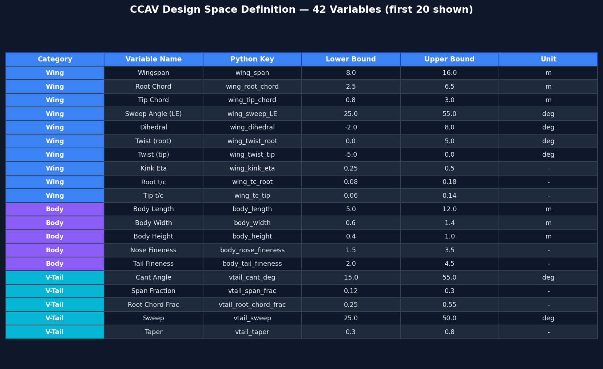
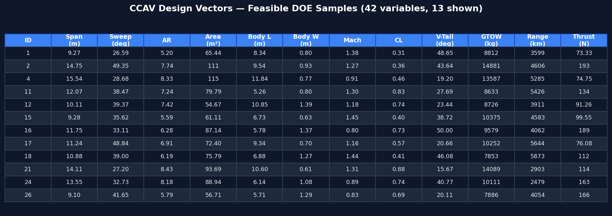
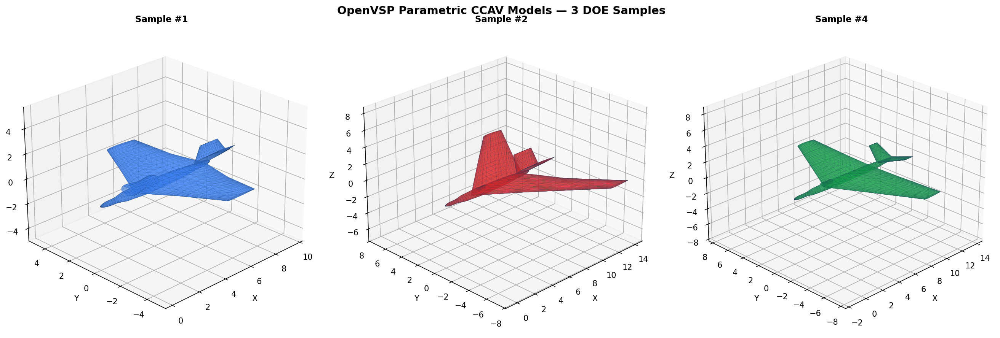
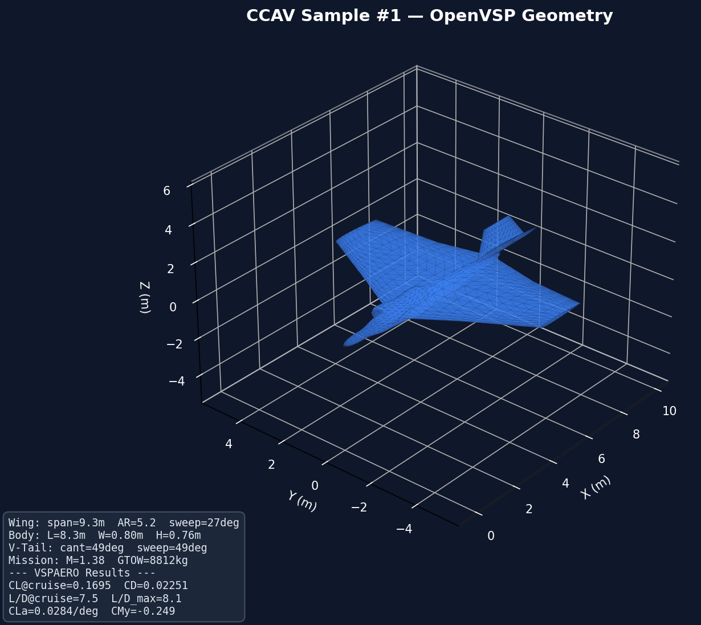
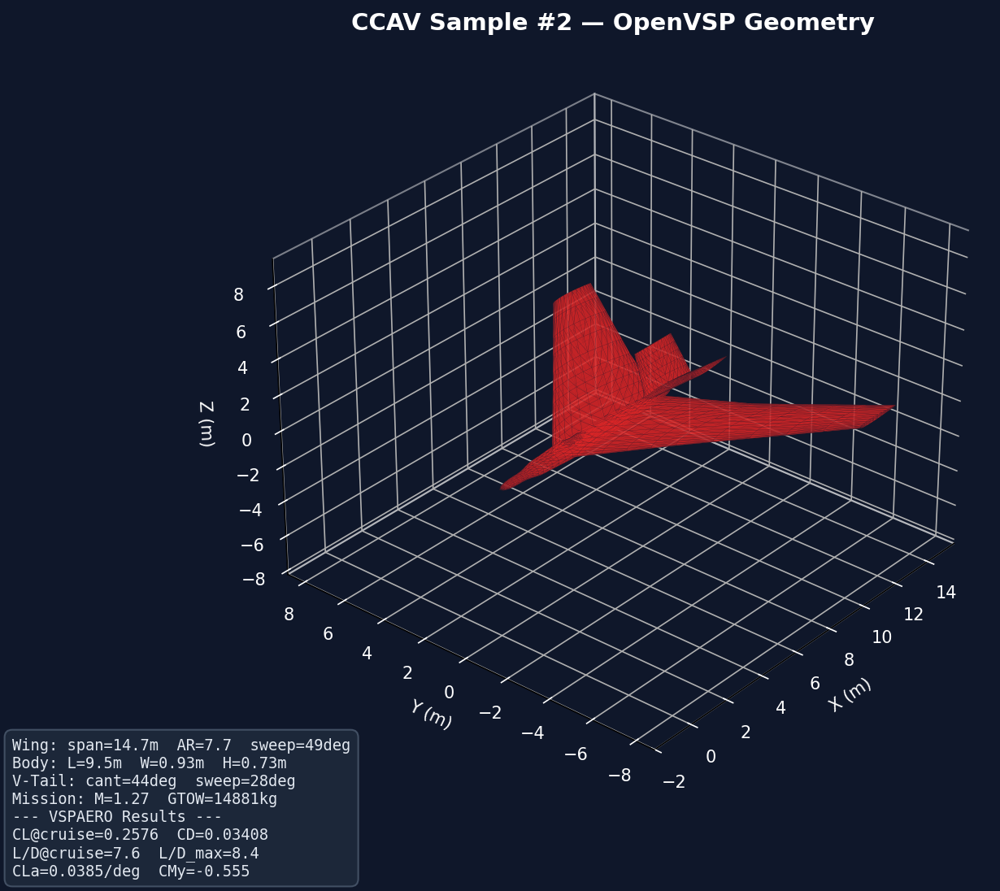
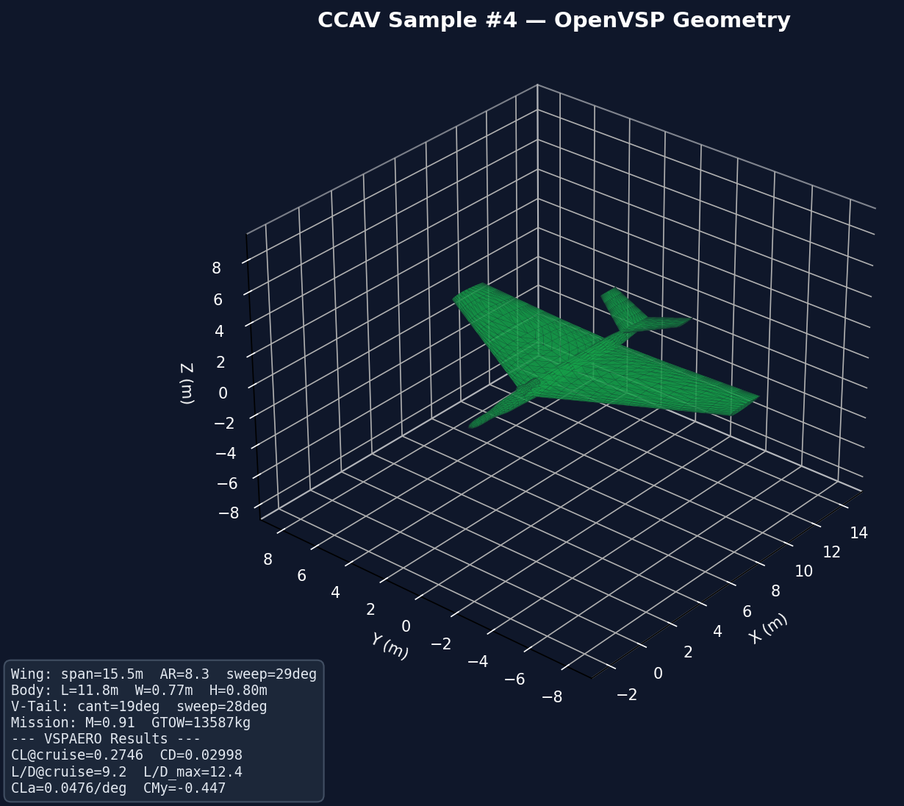

# MDO Lab 4 — CCAV Aerostructural Design

Multi-disciplinary Design Optimisation pipeline for a Cooperative Combat Air Vehicle (CCAV).
V-tail, single-engine, stealth-aligned, Mach 0.8–1.5 flight regime.


## Current Status

| Stage | Description | Status |
|-------|-------------|--------|
| 1 | Design Space Definition (42 variables, 6 derived) | Complete |
| 2 | DOE / LHS Sampling + Physics Pre-filter | Complete |
| 3 | Low-fi Analytical Screening (Aero/Struct/RCS) | Complete |
| 4 | OpenVSP Parametric Geometry + VSPAERO VLM | Complete |
| 5 | Mid-fi CFD (OpenFOAM RANS) | Planned |
| 6 | Structural Analysis (TACS FEM) | Planned |
| 7 | Coupled Aerostructural Optimisation | Planned |

## Quick Start

```bash
pip install -r requirements.txt
python explorer_app.py          # opens http://127.0.0.1:5050
```

---

## Stage 1 — Design Space

34 design variables covering wing geometry, fuselage, propulsion, mass budget,
stealth signatures, and stability derivatives. 6 additional variables are derived
via calibrated K-factor formulas (K_BLEND=2.24, K_AR=2.143, K_IXX=0.00455,
K_FUEL=0.0167). Source of truth: `config/design_space.xlsx`.

https://github.com/user-attachments/assets/efb87553-c95b-4421-93bd-db9dda3e1066


Key modules:
- `pipeline/stage1_design_space.py` — bounds, derived formulas, 9 physics validation checks
- `pipeline/design_vector.py` — DesignVector class wrapping 34-var sample into 63 grouped CAD params

## Stage 2 — DOE & Sampling


500 Latin-Hypercube samples (scipy.stats.qmc, optimized), physics pre-filtered
through 9 constraint checks -> ~283 feasible (56.5% pass rate).

Key modules:
- `pipeline/stage2_doe.py` — LHS generation + validation
- `pipeline/visualise_doe.py` — 6 diagnostic PNG plots

## Interactive Explorer


`explorer_app.py` — local Python HTTP server serving a single-page 3D Plotly app:
- 3D scatter plot with axis/preset/colour controls
- Translucent feasible-region cloud (mesh3d convex hull, toggleable)
- Live-editable spreadsheet tab — cell edits recompute derived vars, re-validate, and update the plot instantly
- Point inspector with full CAD parameter breakdown

---

## Stage 3 — Analytical Screening

Multi-discipline rapid analysis using analytical solvers:

| Discipline | Method | Key outputs |
|------------|--------|-------------|
| **Aero** | Lifting-line + flat-plate drag (wave drag at M > 1) | CL, CD, L/D, Oswald e |
| **Structures** | Euler-Bernoulli beam (wing box) | σ_max, δ_tip, mass_struct |
| **Stealth** | Heuristic RCS from alignment + shielding | RCS (dBsm) |

**Objective:** J_norm = 0.4 × (L/D penalty) + 0.3 × (mass penalty) + 0.3 × (RCS penalty)

**Hard constraints:** stress < 450 MPa, RCS < -20 dBsm, L/D > 5.0

---

## Stage 4 — OpenVSP Parametric Geometry + VSPAERO VLM

Each feasible DOE sample is converted into a full OpenVSP 3D model and run through VSPAERO Vortex Lattice Method analysis.

```
config/ccav_design_space.csv → LHS DOE → ccav_feasible.csv → OpenVSP geometry → VSPAERO VLM → results CSV
```

### Design Space Definition (42 Variables)



| Category | Count | Examples |
|----------|-------|---------|
| Wing | 10 | span (8–16 m), root/tip chord, sweep, dihedral, twist, t/c |
| Body | 5 | length (5–12 m), width, height, nose/tail fineness |
| V-Tail | 6 | cant angle (15–55°), span fraction, sweep, taper, t/c |
| Inlet | 4 | width, height, x-fraction, shielding factor |
| Propulsion | 3 | thrust max/cruise, TSFC |
| Mission | 6 | Mach (0.7–1.5), range, CL, fuel mass, payload, load factor |
| Stealth | 2 | frontal RCS, alignment angle |
| **Derived** | **6** | taper ratio, wing area (K_BLEND=1.85), AR, inlet area, mass_empty (Raymer), GTOW |

### Parametric Design Vectors (283 Feasible Samples)




### OpenVSP Components Built per Sample

| Component | OpenVSP Type | Parameterisation |
|-----------|-------------|------------------|
| Wing | WING | 2-section cranked planform, NACA 4-series, kink at η |
| Fuselage | FUSELAGE | 7 super-ellipse cross-sections (M=N=2.5), nose/tail fineness |
| V-Tail | WING | Symmetric pair, cant angle = dihedral |
| Inlet | STACK | 3 elliptical cross-sections, dorsal placement |

### OpenVSP 3D Models — Different DOE Samples



#### Sample #1


#### Sample #2


#### Sample #4


### VSPAERO Output Metrics

| Metric | Description |
|--------|-------------|
| `vsp_CL_at_cruise` | Lift coefficient at cruise alpha (3°) |
| `vsp_CD_at_cruise` | Total drag coefficient at cruise alpha |
| `vsp_LD_at_cruise` | Lift-to-drag ratio at cruise alpha |
| `vsp_CMy_at_cruise` | Pitching moment at cruise alpha |
| `vsp_CL_max` | Maximum CL across alpha sweep |
| `vsp_CD_min` | Minimum CD across alpha sweep |
| `vsp_LD_max` | Maximum L/D across alpha sweep |
| `vsp_CLa_per_deg` | Lift-curve slope (linear region) |

### VSPAERO Results


---

## Repository Structure

```
config/
  ccav_design_space.csv         # 42-variable CCAV design space (source of truth)
data/
  ccav_feasible.csv             # 283 feasible DOE samples
  ccav_doe_samples.csv          # All 500 DOE samples
  ccav_screening_results.csv    # Analytical screening results
docs/
  images/                       # README screenshots and plots
pipeline/
  __init__.py                   # public API exports
  ccav_sampler.py               # design space reader, LHS DOE, physics validation
  vsp_geometry.py               # parametric OpenVSP model builder (wing, body, vtail, inlet)
  vsp_aero_config.py            # VSPAERO config dataclass + key constants
  vsp_batch_runner.py           # batch orchestrator (CSV → geometry → VSPAERO → results)
  stage3_screening.py           # aero/struct/RCS screening + objective ranking
  stage3_gui.py                 # PyQt6 desktop screening monitor
  visualise_doe.py              # 6 diagnostic matplotlib plots
  _legacy/                      # retired: stage1_design_space, stage2_doe, design_vector
explorer_app.py                 # HTTP + SSE + Plotly.js 3D explorer
output/
  vsp_batch/                    # VSPAERO batch results (per-sample dirs + aggregated CSV)
openvsp_pipeline/               # Standalone bundled copy for GitHub backup
requirements.txt
```

## OpenVSP Batch Usage

```bash
# Requires OpenVSP 3.48.2 + separate Python 3.13 venv (.venv_vsp/)

# Generate DOE samples
python -m pipeline.ccav_sampler --samples 500 --seed 42

# Run batch (all feasible samples)
python pipeline/vsp_batch_runner.py --input data/ccav_feasible.csv --output output/vsp_batch

# Quick test (10 samples)
python pipeline/vsp_batch_runner.py --max-samples 10 --ncpu 4 -v

# Custom alpha sweep
python pipeline/vsp_batch_runner.py --alpha-start -2 --alpha-end 12 --alpha-npts 8
```
