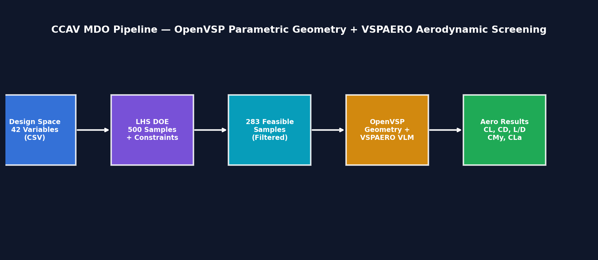
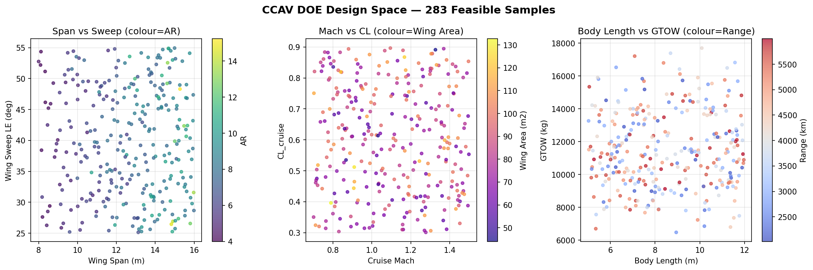
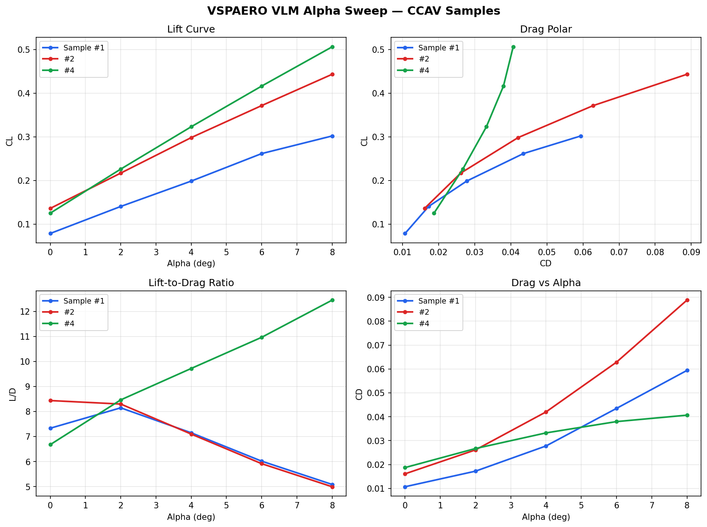
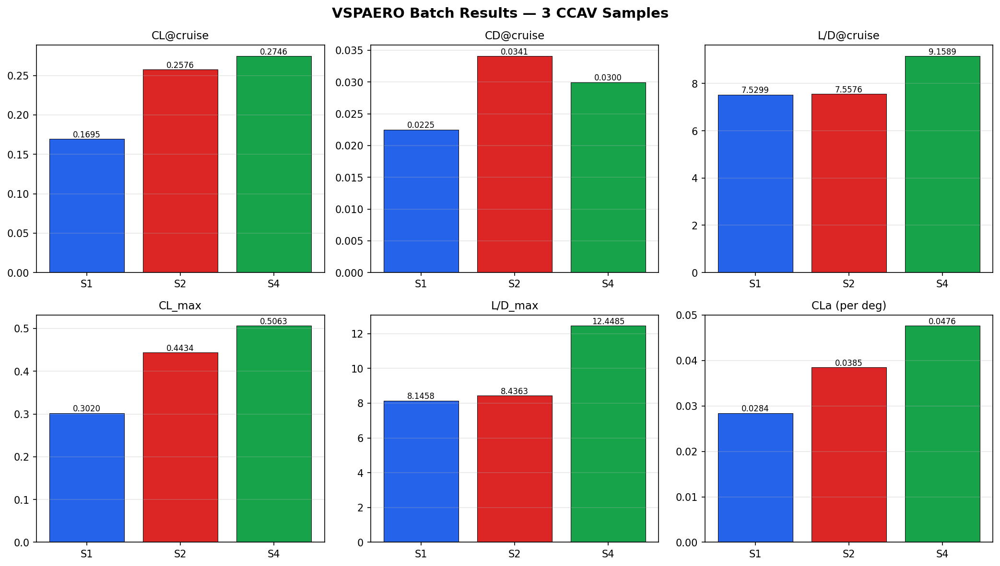

# MDO Lab 4 — CCAV Aerostructural Design

Multi-disciplinary Design Optimisation pipeline for a Cooperative Combat Air Vehicle (CCAV).
V-tail, single-engine, stealth-aligned, Mach 0.8–1.5 flight regime.



## Pipeline Overview

| Stage | Description | Status |
|-------|-------------|--------|
| Design Space | 42-variable CCAV CSV (36 independent + 6 derived) | Complete |
| DOE / Sampling | LHS + 9-constraint physics pre-filter (283/500 feasible) | Complete |
| Screening | Low-fi aero / structures / RCS batch evaluation | Complete |
| OpenVSP Geometry | Parametric .vsp3 model (wing, body, V-tail, inlet) | Complete |
| VSPAERO VLM | Alpha-sweep aerodynamic analysis (CL, CD, L/D, CMy) | Complete |
| Desktop GUI | PyQt6 live screening monitor with real-time plots | Complete |
| Web Explorer | 3D Plotly / Dash interactive visualisation | Complete |

## DOE Design Space

**Source of truth:** `config/ccav_design_space.csv` — 42 variables:

| Category | Count | Examples |
|----------|-------|---------|
| Wing | 10 | span (8–16 m), root/tip chord, sweep, dihedral, twist, t/c |
| Body | 5 | length (5–12 m), width, height, nose/tail fineness |
| V-Tail | 6 | cant angle (15–55°), span fraction, sweep, taper, t/c |
| Inlet | 4 | width, height, x-fraction, shielding factor |
| Propulsion | 3 | thrust max/cruise, TSFC |
| Mission | 6 | Mach (0.7–1.5), range, CL, fuel mass, payload, load factor |
| Stealth | 2 | frontal RCS, alignment angle |
| **Derived** | **6** | taper ratio, wing area (K_BLEND=1.85), AR, inlet area, mass_empty (Raymer), GTOW |

500 Latin-Hypercube samples generated, physics pre-filtered through 9 constraint checks → 283 feasible (56.5% pass rate).



## OpenVSP Parametric Geometry + VSPAERO

Each feasible DOE sample is converted into a full OpenVSP 3D model and run through VSPAERO VLM analysis:

```
ccav_feasible.csv → vsp_geometry.py → .vsp3 model → VSPAERO VLM → aero results CSV
```

### Components Built per Sample

| Component | OpenVSP Type | Parameterisation |
|-----------|-------------|------------------|
| Wing | WING | 2-section cranked planform, NACA 4-series, kink at η |
| Fuselage | FUSELAGE | 7 super-ellipse cross-sections, nose/tail fineness |
| V-Tail | WING | Symmetric pair, cant angle = dihedral |
| Inlet | STACK | 3 elliptical cross-sections, dorsal placement |

### VSPAERO Output Metrics

| Metric | Description |
|--------|-------------|
| `vsp_CL_at_cruise` | Lift coefficient at cruise alpha (3°) |
| `vsp_CD_at_cruise` | Total drag coefficient at cruise alpha |
| `vsp_LD_at_cruise` | Lift-to-drag ratio at cruise alpha |
| `vsp_CMy_at_cruise` | Pitching moment at cruise alpha |
| `vsp_CL_max` | Maximum CL across alpha sweep |
| `vsp_CD_min` | Minimum CD across alpha sweep |
| `vsp_LD_max` | Maximum L/D across alpha sweep |
| `vsp_CLa_per_deg` | Lift-curve slope (linear region) |

### Results





## Analytical Screening (Stage 3)

Multi-discipline rapid analysis using analytical solvers:

| Discipline | Method | Key outputs |
|------------|--------|-------------|
| **Aero** | Lifting-line + flat-plate drag (wave drag at M > 1) | CL, CD, L/D, Oswald e |
| **Structures** | Euler-Bernoulli beam (wing box) | σ_max, δ_tip, mass_struct |
| **Stealth** | Heuristic RCS from alignment + shielding | RCS (dBsm) |

**Objective:** J_norm = 0.4 × (L/D penalty) + 0.3 × (mass penalty) + 0.3 × (RCS penalty)

**Hard constraints:** stress < 450 MPa, RCS < -20 dBsm, L/D > 5.0

## Quick Start

```bash
pip install -r requirements.txt

# Generate CCAV DOE samples (default 500, seed 42)
python -m pipeline.ccav_sampler --samples 720 --seed 42

# Run screening (analytical fallback — no external tools needed)
python -m pipeline.stage3_screening --samples 50 -v

# Launch PyQt6 desktop screening monitor
python -m pipeline.stage3_gui

# Launch web-based 3D explorer
python explorer_app.py        # opens http://127.0.0.1:5050

# Run OpenVSP batch (requires OpenVSP 3.48.2 + Python 3.13 venv)
python pipeline/vsp_batch_runner.py --max-samples 10 --ncpu 4 -v
```

## Repository Structure

```
config/
  ccav_design_space.csv         # 42-variable CCAV design space (source of truth)
data/
  ccav_feasible.csv             # 283 feasible DOE samples
  ccav_doe_samples.csv          # All 500 DOE samples
  ccav_screening_results.csv    # Analytical screening results
docs/
  images/                       # README screenshots and plots
pipeline/
  __init__.py                   # public API exports
  ccav_sampler.py               # design space reader, LHS DOE, physics validation
  vsp_geometry.py               # parametric OpenVSP model builder (wing, body, vtail, inlet)
  vsp_aero_config.py            # VSPAERO config dataclass + key constants
  vsp_batch_runner.py           # batch orchestrator (CSV → geometry → VSPAERO → results)
  stage3_screening.py           # aero/struct/RCS screening + objective ranking
  stage3_gui.py                 # PyQt6 desktop screening monitor
  visualise_doe.py              # 6 diagnostic matplotlib plots
  _legacy/                      # retired: stage1_design_space, stage2_doe, design_vector
explorer_app.py                 # HTTP + SSE + Plotly.js 3D explorer
output/
  vsp_batch/                    # VSPAERO batch results (per-sample dirs + aggregated CSV)
openvsp_pipeline/               # Standalone bundled copy for GitHub backup
requirements.txt
```
